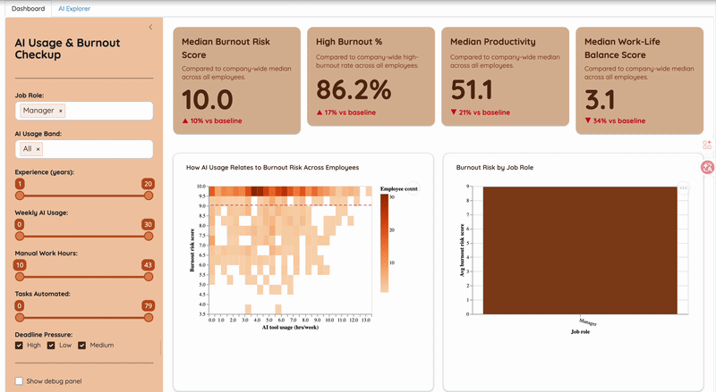

# DSCI-532_2026_9_burnout-checkup

## Overview

**Burnout Checkup** is an **interactive dashboard** designed to **explore the relationship between AI tool usage, workload characteristics, and employee burnout risk**. As organizations increasingly adopt AI tools, it is critical to understand whether productivity gains come at the cost of employee well-being. The app enables users to examine how different workload patterns; including meetings, manual work, and task complexity, interact with AI adoption and influence employee well-being outcomes. By supporting workload-controlled comparisons and subgroup exploration, the dashboard helps managers and people analytics teams identify potential burnout risk patterns and make more informed, data-driven decisions. **Predictive burnout risk indicators** are included as a complementary decision-support layer to surface high-risk scenarios. The goal is to support sustainable AI adoption strategies that protect employee well-being.

---

## Live Application

Main deployment:
https://mara-sanchez1-burnout-checkup.share.connect.posit.cloud  

Development deployment:
https://mara-sanchez1-burnout-checkup-dev.share.connect.posit.cloud  

---

## Demo

Below is a short demonstration of the dashboard:



---

## Features

- Interactive filtering by:
  - Job role
  - AI usage band
  - Experience range
  - Weekly AI usage
  - Manual work hours
  - Tasks automated percentage
  - Deadline pressure level

- Key Performance Indicators:
  - Average burnout risk score
  - Average productivity score
  - Burnout vs company baseline
  - Average work-life balance score

- Visualizations:
  - AI usage vs burnout scatter plot
  - Burnout by job role
  - Weekly work hours breakdown
  - Productivity vs burnout

- Reset filters functionality

---

## For Users

### What problem does this dashboard solve?

Organizations adopting AI tools often measure productivity improvements but may overlook hidden burnout risks.

This dashboard helps answer:

- Are employees using more AI experiencing higher burnout?
- Is burnout primarily driven by deadline pressure?
- Are productivity gains sustainable?

### How to use the dashboard

1. Use the sidebar filters to select employee segments.
2. Observe KPI changes at the top.
3. Explore relationships in scatter plots.
4. Reset filters to return to full dataset view.

---

## For Contributors

We welcome contributions in the form of code improvements, feature additions,
documentation updates, or bug reports.

### Development Setup

1. Clone the repository:

```bash
git clone https://github.com/UBC-MDS/DSCI-532_2026_9_burnout-checkup.git
cd DSCI-532_2026_9_burnout-checkup
```

2. Create and activate the environment:

```bash
conda env create -f environment.yml
conda activate burnout_checkup
```

3. Setup Environment variables

- i. Copy `.env.example` to `.env`
- ii. Add your Anthropic API key to `.env`

Example:

```bash
cp .env.example .env
```

4. Build dataset

```bash
python src/scripts/build_parquet.py
```

5. Run the dashboard locally:

```bash
shiny run src.app
```

or

```bash
 shiny run --reload src/app.py
```

### Running tests

This project uses:

- **pytest** for unit testing
- **Playwright** for end-to-end dashboard testing
Ensure that the project environment is activated.

#### Unit Tests

Run all non-E2E tests with:

```bash
pytest -k "not e2e"
```

To run a specific test file (e.g.: `test_data.py`):

```bash
python -m pytest tests/test_data.py
```

#### End-to-end tests

The Playwright tests expect the Shiny app to be running locally on port 8000 (`http://localhost:8000`). If Playwright browsers are not installed yet, run:

```bash
playwright install
```

If not started yet, start the app in one terminal:

```bash
python -m shiny run --reload --port 8000 src/app.py
```

Then run the end-to-end tests in another terminal:

```bash
pytest tests/e2e
```

#### Run the full test suite

With the app running on port 8000, run:

```bash
pytest
```

or

```bash
python -m pytest
```

### Contribution Guidelines

This project follows a structured GitHub workflow:

- All work is done on feature branches
- Each task corresponds to a GitHub issue
- Pull requests require review before merging
- No direct commits to main

For detailed contribution rules, branch naming conventions, and the full
workflow, please see:

👉 [CONTRIBUTING.md](CONTRIBUTING.md) 