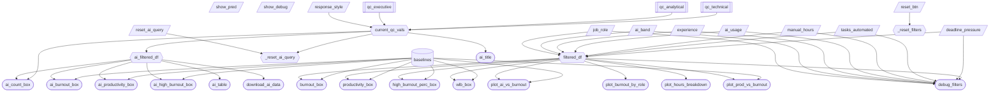

# App Specification

## 2.1 Updated Job Stories

| #   | Job Story                       | Status         | Notes                         |
| --- | ------------------------------- | -------------- | ----------------------------- |
| 1   | **When** reviewing employee well-being and productivity reports, **I want to** separate burnout caused by workload from burnout potentially associated with AI usage, **so I can** make informed AI adoption decisions without misattributing the root cause of burnout. | ✅ Implemented | This job story was implemented through interactive filters (job role, AI usage, manual hours, experience) and visual comparisons (AI Usage vs Burnout scatterplot and Burnout Risk by Job Role). These allow users to isolate workload-related factors from AI usage and assess burnout drivers more accurately. |
| 2   | **When** investigating increased burnout within specific teams, **I want to** analyze how AI usage interacts with deadline pressure, **so I can** design targeted interventions such as workload adjustments or AI training. | ✅ Implemented | Changed focus from *task complexity and deadline pressure* to just *deadline pressure* because it is a more directly actionable and interpretable driver of burnout. |
| 3   | **When** evaluating the impact of AI tools on productivity, **I want to** compare productivity gains against changes in burnout risk, **so I can** ensure performance improvements are sustainable and do not harm employee well-being. | ✅ Implemented | This job story was implemented using KPI cards (Avg Productivity Score, High Burnout %) and the Productivity vs Burnout Risk scatterplot. These components enable evaluation of productivity gains and burnout risk, helping users assess whether AI-related performance improvements are sustainable. |

## 2.2 Component Inventory

| ID | Type | Shiny widget / renderer | Depends on | Job story |
|---|---|---|---|---|
| `job_role` | Input | `ui.input_selectize()` | — | #1, #2 |
| `ai_band` | Input | `ui.input_selectize()` | — | #1, #3 |
| `experience` | Input | `ui.input_slider()` | — | #1 |
| `ai_usage` | Input | `ui.input_slider()` | — | #1, #3 |
| `manual_hours` | Input | `ui.input_slider()` | — | #1 |
| `tasks_automated` | Input | `ui.input_slider()` | — | #1 |
| `deadline_pressure` | Input | `ui.input_checkbox_group()` | — | #1, #2 |
| `show_pred` | Input | `ui.input_checkbox()` | — | — |
| `show_debug` | Input | `ui.input_checkbox()` | — | — |
| `reset_btn` | Input | `ui.input_action_button()` | — | #1, #2, #3 |
| `filtered_df` | Reactive calc | `@reactive.calc` | dashboard filter inputs | #1, #2, #3 |
| `_reset_filters` | Reactive effect | `@reactive.effect` + `@reactive.event(input.reset_btn)` | `reset_btn` | #1, #2, #3 |
| `burnout_box` | Output | `@render.ui` | `filtered_df`, baselines | #1 |
| `high_burnout_perc_box` | Output | `@render.ui` | `filtered_df`, baselines | #1 |
| `productivity_box` | Output | `@render.ui` | `filtered_df`, baselines | #1, #3 |
| `wlb_box` | Output | `@render.ui` | `filtered_df`, baselines | #1 |
| `plot_ai_vs_burnout` | Output | `@render_altair` | `filtered_df`, baselines | #1, #2 |
| `plot_burnout_by_role` | Output | `@render_altair` | `filtered_df` | #2 |
| `plot_hours_breakdown` | Output | `@render_altair` | `filtered_df` | #1 |
| `plot_prod_vs_burnout` | Output | `@render_altair` | `filtered_df`, baselines | #3 |
| `debug_filters` | Output | `@render.text` | dashboard inputs, `filtered_df` | — |
| `response_style` | Input | `ui.input_select()` | — | AI Explorer |
| `reset_ai_query` | Input | `ui.input_action_button()` | — | AI Explorer |
| `qc_executive` | Module UI/server | `QueryChat(...).ui()` / `.server()` | `response_style` | AI Explorer |
| `qc_analytical` | Module UI/server | `QueryChat(...).ui()` / `.server()` | `response_style` | AI Explorer |
| `qc_technical` | Module UI/server | `QueryChat(...).ui()` / `.server()` | `response_style` | AI Explorer |
| `current_qc_vals` | Reactive calc | `@reactive.calc` | `response_style`, QueryChat modules | AI Explorer |
| `ai_filtered_df` | Reactive calc | `@reactive.calc` | `current_qc_vals` | AI Explorer |
| `_reset_ai_query` | Reactive effect | `@reactive.effect` + `@reactive.event(input.reset_ai_query)` | `reset_ai_query`, `current_qc_vals` | AI Explorer |
| `ai_title` | Output | `@render.text` | `current_qc_vals` | AI Explorer |
| `ai_count_box` | Output | `@render.ui` | `ai_filtered_df`, `current_qc_vals` | AI Explorer |
| `ai_burnout_box` | Output | `@render.ui` | `ai_filtered_df`, baselines | AI Explorer |
| `ai_productivity_box` | Output | `@render.ui` | `ai_filtered_df`, baselines | AI Explorer |
| `ai_high_burnout_box` | Output | `@render.ui` | `ai_filtered_df`, baselines | AI Explorer |
| `ai_table` | Output | `@render.data_frame` + `DataGrid` | `ai_filtered_df` | AI Explorer |
| `download_ai_data` | Output | `@render.download` | `ai_filtered_df` | AI Explorer |

## 2.3 Reactivity Diagram

```mermaid
flowchart TD

  %% -------------------
  %% Inputs (Dashboard)
  %% -------------------
  job_role[/job_role/]
  ai_band[/ai_band/]
  experience[/experience/]
  ai_usage[/ai_usage/]
  manual_hours[/manual_hours/]
  tasks_automated[/tasks_automated/]
  deadline_pressure[/deadline_pressure/]
  show_pred[/show_pred/]
  show_debug[/show_debug/]
  reset_btn[/reset_btn/]

  %% -------------------
  %% Inputs (AI Explorer)
  %% -------------------
  response_style[/response_style/]
  reset_ai_query[/reset_ai_query/]

  %% -------------------
  %% Reactives
  %% -------------------
  filtered_df{{filtered_df}}
  reset_effect{{_reset_filters}}

  current_qc_vals{{current_qc_vals}}
  ai_filtered_df{{ai_filtered_df}}
  reset_ai_effect{{_reset_ai_query}}

  %% -------------------
  %% QueryChat modules
  %% -------------------
  qc_executive[[qc_executive]]
  qc_analytical[[qc_analytical]]
  qc_technical[[qc_technical]]

  %% -------------------
  %% Baselines
  %% -------------------
  baselines[(baselines)]

  %% -------------------
  %% Dashboard filtering
  %% -------------------
  job_role --> filtered_df
  ai_band --> filtered_df
  experience --> filtered_df
  ai_usage --> filtered_df
  manual_hours --> filtered_df
  tasks_automated --> filtered_df
  deadline_pressure --> filtered_df

  %% Reset filters
  reset_btn --> reset_effect

  %% -------------------
  %% KPI Outputs
  %% -------------------
  burnout_box([burnout_box])
  productivity_box([productivity_box])
  high_burnout_perc_box([high_burnout_perc_box])
  wlb_box([wlb_box])

  filtered_df --> burnout_box
  baselines --> burnout_box

  filtered_df --> productivity_box
  baselines --> productivity_box

  filtered_df --> high_burnout_perc_box
  baselines --> high_burnout_perc_box

  filtered_df --> wlb_box
  baselines --> wlb_box

  %% -------------------
  %% Plot Outputs
  %% -------------------
  plot_ai_vs_burnout([plot_ai_vs_burnout])
  plot_burnout_by_role([plot_burnout_by_role])
  plot_hours_breakdown([plot_hours_breakdown])
  plot_prod_vs_burnout([plot_prod_vs_burnout])

  filtered_df --> plot_ai_vs_burnout
  baselines --> plot_ai_vs_burnout

  filtered_df --> plot_burnout_by_role
  filtered_df --> plot_hours_breakdown

  filtered_df --> plot_prod_vs_burnout
  baselines --> plot_prod_vs_burnout

  %% -------------------
  %% Debug output
  %% -------------------
  debug_filters([debug_filters])

  job_role --> debug_filters
  ai_band --> debug_filters
  experience --> debug_filters
  ai_usage --> debug_filters
  manual_hours --> debug_filters
  tasks_automated --> debug_filters
  deadline_pressure --> debug_filters
  filtered_df --> debug_filters

  %% -------------------
  %% QueryChat logic
  %% -------------------
  response_style --> current_qc_vals
  qc_executive --> current_qc_vals
  qc_analytical --> current_qc_vals
  qc_technical --> current_qc_vals

  current_qc_vals --> ai_filtered_df

  reset_ai_query --> reset_ai_effect
  current_qc_vals --> reset_ai_effect

  %% -------------------
  %% AI Explorer outputs
  %% -------------------
  ai_title([ai_title])
  ai_count_box([ai_count_box])
  ai_burnout_box([ai_burnout_box])
  ai_productivity_box([ai_productivity_box])
  ai_high_burnout_box([ai_high_burnout_box])
  ai_table([ai_table])
  download_ai_data([download_ai_data])

  current_qc_vals --> ai_title

  ai_filtered_df --> ai_count_box
  current_qc_vals --> ai_count_box

  ai_filtered_df --> ai_burnout_box
  baselines --> ai_burnout_box

  ai_filtered_df --> ai_productivity_box
  baselines --> ai_productivity_box

  ai_filtered_df --> ai_high_burnout_box
  baselines --> ai_high_burnout_box

  ai_filtered_df --> ai_table
  ai_filtered_df --> download_ai_data
```

## 2.4 Calculation Details

### filtered_df (@reactive.calc)

**Depends on:**

- `job_role`
- `ai_band`
- `experience_years`
- `ai_tool_usage_hours_per_week`
- `manual_work_hours_per_week`
- `tasks_automated_percent`
- `deadline_pressure_level`

**Transformation:**
Starts from the full DuckDB/Ibis (`table`) and applies the dashboard sidebar filters sequentially.  
If `job_role` or `ai_band` are set to values other than `"All"`, the data is filtered to those selected categories.  
It then filters numeric columns using the selected slider ranges for:

- `experience_years`
- `ai_tool_usage_hours_per_week`
- `manual_work_hours_per_week`
- `tasks_automated_percent`

Finally, if any `deadline_pressure` options are selected, it filters `deadline_pressure_level` to those values.  
The resulting filtered Ibis expression is then executed and returned as a pandas dataframe.

**Consumed by:**

- `burnout_box`
- `productivity_box`
- `high_burnout_perc_box`
- `wlb_box`
- `plot_ai_vs_burnout`
- `plot_burnout_by_role`
- `plot_hours_breakdown`
- `plot_prod_vs_burnout`

### current_qc_vals (`@reactive.calc`)

**Depends on:**

- `response_style`
- `qc_executive`
- `qc_analytical`
- `qc_technical`

**Transformation:**
Selects which QueryChat server object to use based on the selected `response_style`.

- If `response_style == "executive"`, it returns `qc_executive_vals`
- If `response_style == "technical"`, it returns `qc_technical_vals`
- Otherwise, it returns `qc_analytical_vals`

This reactive acts as a router so that downstream AI Explorer outputs always use the currently active QueryChat module.

**Consumed by:**

- `ai_filtered_df`
- `ai_title`
- `ai_count_box`
- `_reset_ai_query`

### ai_filtered_df (`@reactive.calc`)

**Depends on:**

- `current_qc_vals`

**Transformation:**
Retrieves the currently active QueryChat values object from `current_qc_vals()` and checks its SQL query and returned dataframe.

- If no AI query has been run yet (`qc_vals.sql()` is empty), it returns `default_ai_preview_df`, which contains the first 100 rows of the full dataset.
- If QueryChat has executed a valid query and returned a pandas dataframe, it returns that dataframe.
- If an unexpected result occurs, it falls back to `default_ai_preview_df`.

This reactive ensures that the AI Explorer always displays either:
1. a default preview before any query is submitted, or  
2. the full result of the most recent valid AI query.

**Consumed by:**

- `ai_count_box`
- `ai_burnout_box`
- `ai_productivity_box`
- `ai_high_burnout_box`
- `ai_table`
- `download_ai_data`

### _reset_ai_query (`@reactive.effect` + `@reactive.event(input.reset_ai_query)`)

**Depends on:**

- `reset_ai_query`
- `current_qc_vals`

**Transformation:**
Triggers when the user clicks the `reset_ai_query` button.  
It accesses the currently active QueryChat values object from `current_qc_vals()` and clears its stored SQL query and title by setting:

- `qc_vals.sql("")`
- `qc_vals.title(None)`

This resets the AI Explorer state so the table and KPIs return to the default preview behavior.

**Consumed by:**

- No downstream reactive directly consumes this effect; instead, it updates QueryChat state, which causes `ai_filtered_df`, `ai_title`, and related AI Explorer outputs to re-render.

## 2.5 AI Explorer (QueryChat)

### AI Prompt

The dashboard includes an AI assistant powered by QueryChat that allows users to ask questions about the dataset.

The system prompt was customized to reflect the dashboard’s target audience (HR analytics managers) and the key analytical goals of the app, including:

- identifying burnout patterns across job roles
- understanding relationships between AI usage and burnout
- evaluating productivity vs burnout trade-offs

This prompt customization helps ensure that the AI assistant provides explanations aligned with HR decision-making rather than generic statistical descriptions.

### QueryChat Response Style Control

The AI Explorer tab also includes a **Response Style control** that allows users to modify how the large language model (LLM) frames its responses. This control was introduced to provide users with flexibility in how AI-generated explanations are presented while maintaining consistency with the dataset context.

#### Feature Description

A dropdown input is provided in the AI Explorer sidebar with the following options:

- **Executive Summary** - concise, high-level insights suitable for quick decision-making.
- **Analytical Explanation** - balanced interpretation of dataset patterns and relationships.
- **Technical Interpretation** - more precise explanations referencing dataset variables and analytical limitations.

The selected response style is incorporated into the prompt instructions passed to the LLM, influencing the tone, level of detail, and framing of generated responses.

#### Default Behavior

The **Analytical Explanation** style is selected as the default mode. This style provides the best balance between interpretability, dataset grounding, and readability for typical dashboard users.

#### Design Rationale

The response style control was selected after evaluating several potential QueryChat customization options, including a verbosity slider and a scope-restriction toggle. These alternatives were not prioritized due to either limited behavioral impact (verbosity control) or higher implementation complexity (scope restriction).

An experiment was conducted comparing three response styles across representative user questions about the dataset. Responses were evaluated using the following criteria:

- relevance to the dataset
- clarity
- actionability
- audience fit
- faithfulness to the dataset context

The **Analytical Explanation** style achieved the highest overall evaluation score and demonstrated the most consistent performance across the criteria. As a result, it was selected as the default response style while still allowing users to switch to other modes depending on their needs.

#### Alignment with User Needs

The QueryChat Response Style control supports several of the project's user stories and Jobs-to-Be-Done by enabling users to explore and interpret burnout patterns in different ways depending on their analytical needs.

**User Story 3**  
The AI Explorer allows HR analytics managers to investigate burnout patterns across job roles, experience levels, and AI usage. The response style control improves this exploration by allowing users to choose explanations that best match their decision-making context. For example, an Executive Summary provides quick insights about which roles or experience levels may be most affected, while Analytical or Technical styles provide deeper interpretation of the data.

**JTBD 1 – Distinguishing workload-driven vs AI-associated burnout**  
The analytical and technical response styles help users interpret relationships between workload indicators (manual work hours, deadlines, task complexity) and AI usage variables. This helps users avoid misattributing burnout to AI adoption when other factors may be more influential.

**JTBD 3 – Evaluating productivity alongside burnout risk**  
When examining productivity outcomes relative to burnout scores, the AI Explorer can explain observed patterns in different levels of detail. Analytical responses help managers understand whether productivity gains appear alongside increased burnout risk, while technical responses provide more cautious interpretations of potential relationships in the data.

Overall, the response-style control improves the usability of the AI Explorer by allowing explanations to adapt to different analytical contexts while remaining grounded in the dashboard's dataset.

