# App Specification

## 2.1 Updated Job Stories

| #   | Job Story                       | Status         | Notes                         |
| --- | ------------------------------- | -------------- | ----------------------------- |
| 1   | **When** reviewing employee well-being and productivity reports, **I want to** separate burnout caused by workload from burnout potentially associated with AI usage, **so I can** make informed AI adoption decisions without misattributing the root cause of burnout. | ✅ Implemented | Pending |
| 2   | **When** investigating increased burnout within specific teams, **I want to** analyze how AI usage interacts with deadline pressure, **so I can** design targeted interventions such as workload adjustments or AI training. | 🔄 Revised | Changed focus from *task complexity and deadline pressure* to just *deadline pressure* because it is a more directly actionable and interpretable driver of burnout. |
| 3   | **When** evaluating the impact of AI tools on productivity, **I want to** compare productivity gains against changes in burnout risk, **so I can** ensure performance improvements are sustainable and do not harm employee well-being. | ✅ Implemented | Pending |

## 2.2 Component Inventory

| ID                | Type          | Shiny widget / renderer | Depends on                   | Job story  |
| ------------------| ------------- | ----------------------- | ---------------------------- | ---------- |
| `job_role`        | Input         | `ui.input_selectize()`  | —                            | #1, #2     |
| `ai_band`         | Input         | `ui.input_selectize()`  | —                            | #1, #3     |
| `experience_years`| Input         | `ui.input_slider()`     | —                            | #1         |
| `ai_tool_usage_hours_per_week`    | Input         | `ui.input_slider()`     | —            | #1, #3     |
| `manual_work_hours_per_week`      | Input         | `ui.input_slider()`     | —            | #1         |
| `tasks_automated_percent`         | Input         | `ui.input_slider()`     | —            | #1         |
| `deadline_pressure_level`         | Input         | `ui.input_checkbox_group()`| —         | #1, #2     |
| `reset_btn`       | Input         | `ui.input_action_button()` | -                         | #1, #2, #3 |
| `filtered_df`     | Reactive calc | `@reactive.calc`        | all inputs above             | #1, #2, #3 |
| `_reset_filters`  | Reactive effect | `@reactive.effect` + `@reactive.event(input.reset_btn)`| `reset_btn`  | #1, #2, #3 |
| `burnout_box`     | Output        | `@render.ui`                | `filtered_df`, baselines              | #1       |
| `productivity_box`| Output        |` @render.ui`                | `filtered_df`, baselines               | #1, #3   |
| `high_burnout_perc_box`   | Output    | `@render.ui`                | `filtered_df`, baselines     | #1       |
| `wlb_box`             | Output    | `@render.ui`                | `filtered_df` , baselines               | #1       |
| `plot_ai_vs_burnout`  | Output    | `@render_altair`              | `filtered_df`, baselines     | #1, #2   |
| `plot_burnout_by_role`| Output    | `@render_altair`              | `filtered_df`                | #2       |
| `plot_hours_breakdown`| Output    | `@render_altair`              | `filtered_df`                | #1       |
| `plot_prod_vs_burnout`| Output    | `@render_altair`              | `filtered_df`, baselines     | #3       |

## 2.3 Reactivity Diagram

```mermaid
flowchart TD

  %% -------------------
  %% Inputs
  %% -------------------
  job_role[/job_role/]
  ai_band[/ai_band/]
  experience_years[/experience_years/]
  ai_tool_usage_hours_per_week[/ai_tool_usage_hours_per_week/]
  manual_work_hours_per_week[/manual_work_hours_per_week/]
  tasks_automated_percent[/tasks_automated_percent/]
  deadline_pressure_level[/deadline_pressure_level/]
  reset_btn[/reset_btn/]

  %% -------------------
  %% Reactives
  %% -------------------
  filtered_df{{filtered_df}}
  reset_effect{{_reset_filters}}

  %% Input -> filtered_df
  job_role --> filtered_df
  ai_band --> filtered_df
  experience_years --> filtered_df
  ai_tool_usage_hours_per_week --> filtered_df
  manual_work_hours_per_week --> filtered_df
  tasks_automated_percent --> filtered_df
  deadline_pressure_level --> filtered_df

  %% Reset button
  reset_btn --> reset_effect

  %% -------------------
  %% Outputs (ui)
  %% -------------------
  burnout_box([burnout_box])
  productivity_box([productivity_box])
  high_burnout_perc_box([high_burnout_perc_box])
  wlb_box([wlb_box])

  %% -------------------
  %% Outputs (plots)
  %% -------------------
  plot_ai_vs_burnout([plot_ai_vs_burnout])
  plot_burnout_by_role([plot_burnout_by_role])
  plot_hours_breakdown([plot_hours_breakdown])
  plot_prod_vs_burnout([plot_prod_vs_burnout])

  %% filtered_df dependencies
  filtered_df --> plot_burnout_by_role
  filtered_df --> plot_hours_breakdown

  %% filtered_df + baselines dependencies
  filtered_df --> burnout_box
  baselines --> burnout_box

  filtered_df --> productivity_box
  baselines --> productivity_box

  filtered_df --> high_burnout_perc_box
  baselines --> high_burnout_perc_box

  filtered_df --> wlb_box
  baselines --> wlb_box

  filtered_df --> plot_ai_vs_burnout
  baselines --> plot_ai_vs_burnout

  filtered_df --> plot_prod_vs_burnout
  baselines --> plot_prod_vs_burnout
```

## 2.4 Calculation Details

### filtered_df (@reactive.calc)

**Depends on:**

- `job_role`
- `ai_band`
- `experience_years`
- `ai_tool_usage_hours_per_week`
- `manual_work_hours_per_week`
- `tasks_automated_percent`
- `deadline_pressure_level`

**Transformation:**
Filters the full dataset to retain only observations matching the selected input criteria by the user.

**Consumed by:**

- `burnout_box`
- `productivity_box`
- `high_burnout_perc_box`
- `wlb_box`
- `plot_ai_vs_burnout`
- `plot_burnout_by_role`
- `plot_hours_breakdown`
- `plot_prod_vs_burnout`
